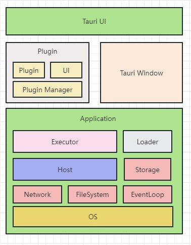

# Rick工具包

## OS

OS 对应运行不同的操作系统

## Network

不同 RickTool 可以构建的网络空间
包含虚拟IP\代理
需要驱动开发

## FileSystem

本地文件系统，可以支持挂在网络文件 需要驱动开发

## EventLoop

整个程序的事件循环

## Host 

虚拟主机对应这Rick Tool 和 SSH 主机

## Storage

全局状态管理

## Executor 

程序执行器

## Loader

加载器

